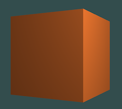

# OpenGL Hello World and Quaternion Cube Rotation

Tiny little experiments as I learn some basics. 

## System Requirements

Developed and tested on a machine with the following specifications:

- macOS version: Ventura 13.3.1
- Processor: Apple M1

You need to have the following libraries installed:

- GLFW (to create a window and OpenGL context)
- GLEW (to use modern OpenGL features)
- GLM (to work with vectors, matrices, and quaternions)

Your mileage may vary. If you encounter any issues, you're on your own.

## HelloOpenGL

Opens an OpenGL window, that's pretty much it.

## HelloQuaternion

Use quaternions to rotate a cube in 3D space. 

## LitCube

Similar to `HelloQuaternion`, but adds lighting. 

## DragLitCube

Based on `LitCube` but adds the ability to drag the cube around. 

The mouse dragging affects the cube's position relative to the origin. The rotation will remain about the Y-axis, so you'll get counter-intuitive results.  Still, it's kidna fun.

The final cube should look like this, all spinning like...

## DragLitCat

Same as `DragLitCube` but now instead of a cube, we use a laughable approximation of a cat.  Honestly, the cube might be a better approximation.

## Building and Running

To build the programs, you can use the provided Makefile by running `make` in the root directory of the project.

After building, you can run each program by executing the respective binary in the `bin` directory.

## Licensing

This project is released under the "Do-Whatever-You-Want-With-This" license.